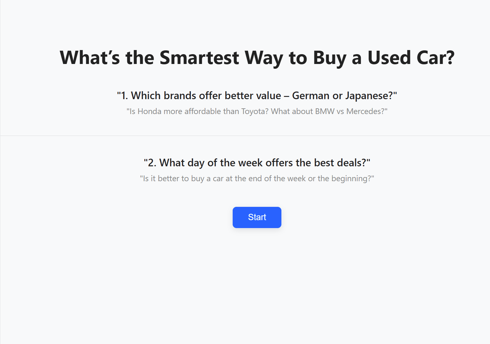

# Narrative Visualization using D3.js for Used Car Price Trends

## Demo

  

**Features & Tools Used:**  
- **Structure:** Martini glass narrative with 4 interactive scenes  
- **Interactions:** Tooltips, legend-based filtering, point highlighting, scene navigation (prev/next buttons), reset view  
- **Annotations:** Consistent d3-annotation template, hidden when filters applied  
- **Visualization Types:** Scatter plots, bar charts, dual-axis charts  
- **Tech Stack:** JavaScript, D3.js, d3-annotation, HTML, CSS, Python 
